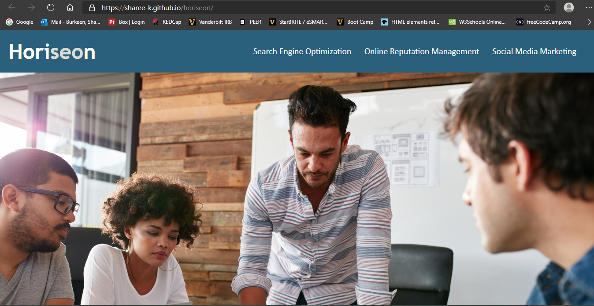
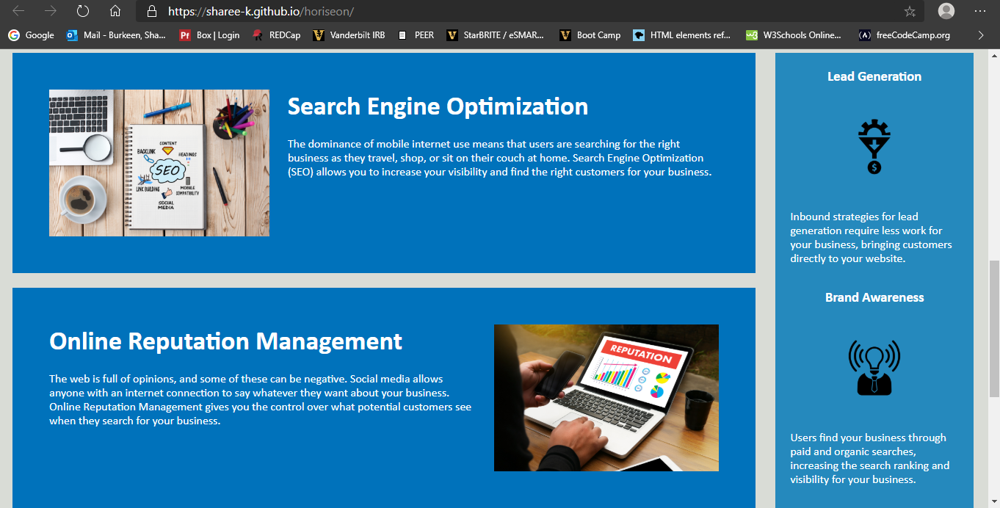
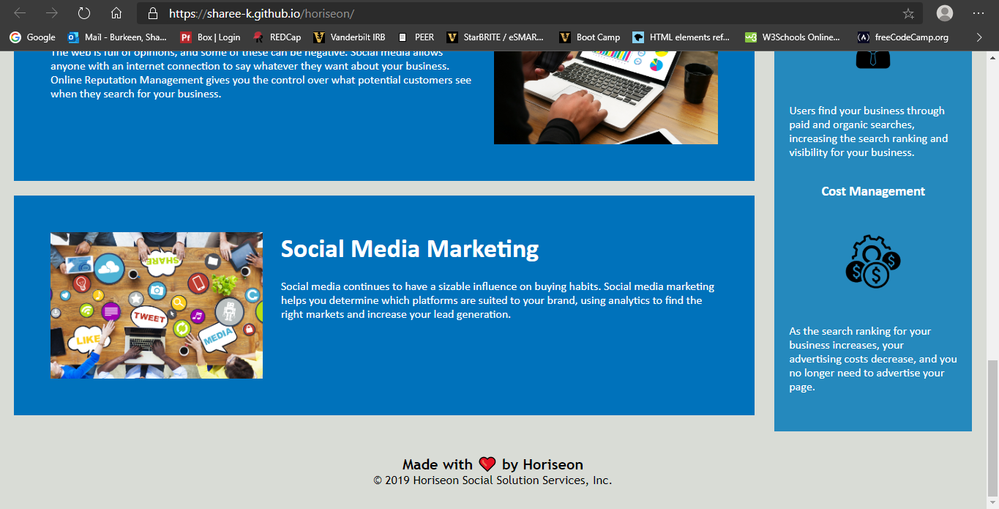
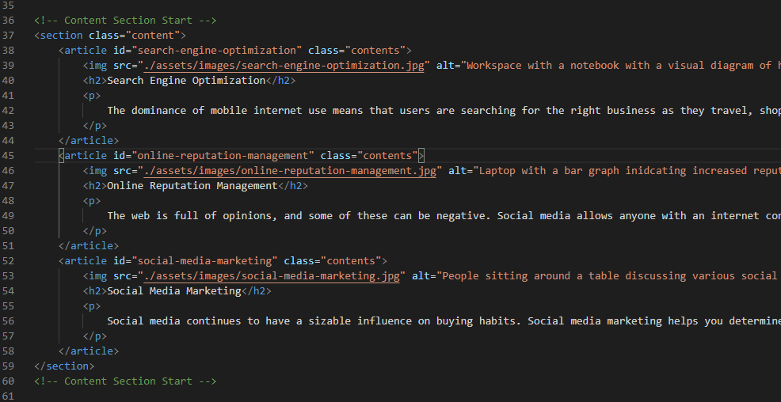
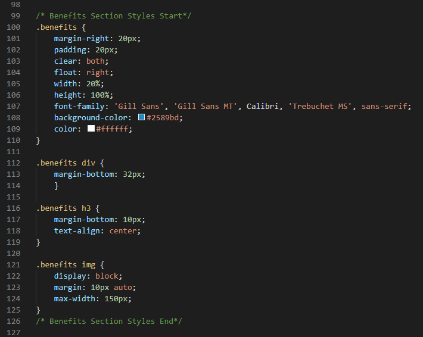

# Horiseon - Code Refactor Challenge
> The is a training project to test my ability to refactor code. I was given starter code and instructed to reformat the HTML file to ensure that it had proper semantic HTML properties, images had accessible alt attributes, and links functioned properly. For the CSS file, I was instructed to properly comment, cosolidate, and organize.

## Table of contents
* [General info](#general-info)
* [Screenshots](#screenshots)
* [Technologies](#technologies)
* [Link](#link)
* [Status](#status)
* [Inspiration](#inspiration)
* [Contribution](#contribution)

## General info
This project is an HTML and CSS refactor challenge.

## Screenshots

## Technologies
* HTML
* CSS

## Link
https://sharee-k.github.io/horiseon/

## Code Examples
Example of HTML commenting and accessible alt attributes:

Example of CSS commenting and consolidating:

## Status
This project is finished for this training challenge.

## Inspiration
Starter code by Xander Rapstine (https://github.com/Xandromus).

Thank you to Malgorzata Rita Ły for the README templage [@flynerdpl](https://www.flynerd.pl/).

## Contribution
Sharee Burkeen (https://github.com/sharee-k)